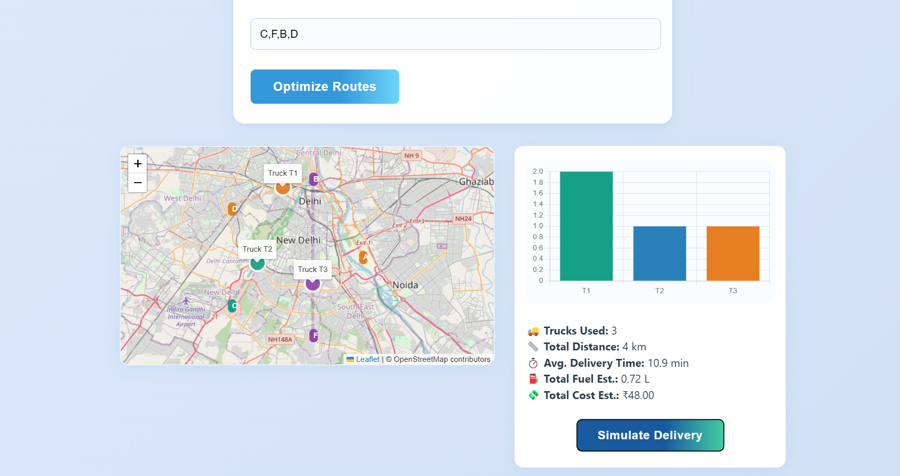
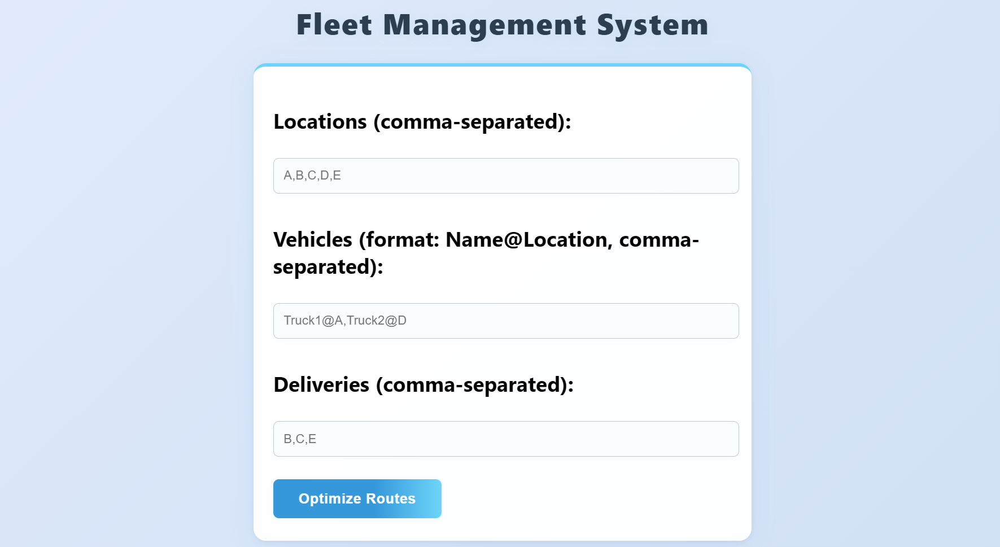
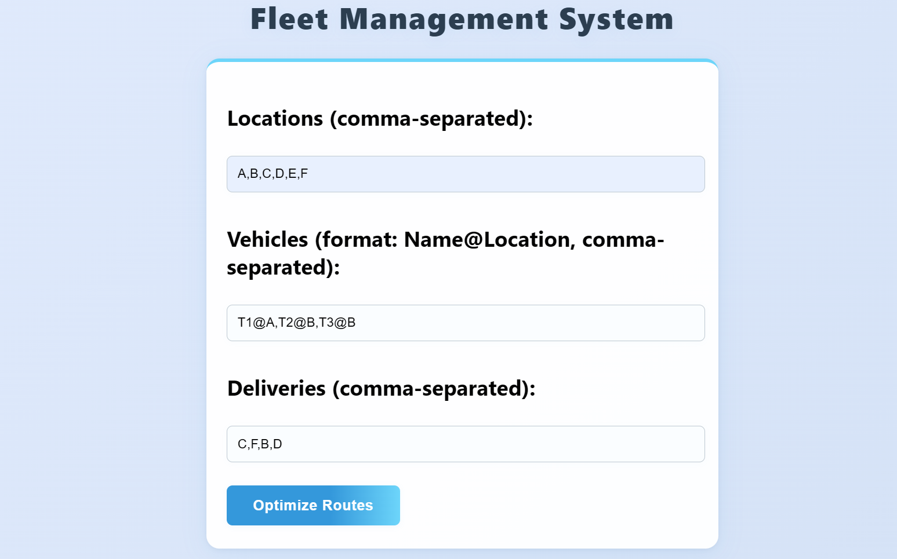
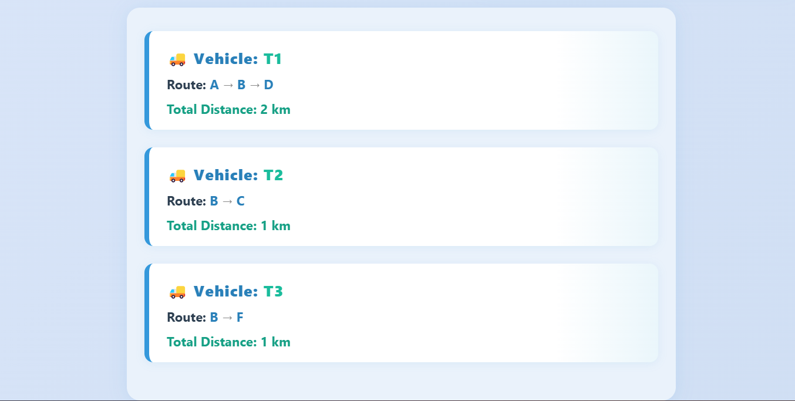

# Fleet Management System 🚚

A comprehensive web-based fleet management and route optimization system that helps businesses efficiently manage their vehicle fleets, optimize delivery routes, and simulate delivery operations.

<p align="center">
  
</p>

## 🌟 Features

### 🗺️ Route Optimization
- **Intelligent Route Planning**: Advanced algorithms to find the most efficient routes for delivery vehicles
- **Multi-location Support**: Manage deliveries across multiple locations simultaneously
- **Real-time Route Calculation**: Dynamic route optimization based on current traffic and delivery requirements

### 🚛 Fleet Management
- **Vehicle Tracking**: Monitor and manage fleet vehicles with location-based assignments
- **Delivery Scheduling**: Organize and schedule deliveries efficiently
- **Performance Analytics**: Track delivery performance and fleet utilization

### 📊 Simulation & Analytics
- **Delivery Simulation**: Test different delivery scenarios before actual deployment
- **Route Visualization**: Interactive maps showing optimized delivery routes
- **Performance Metrics**: Comprehensive analytics for fleet performance monitoring

## 🛠️ Technologies Used

### Frontend
- **HTML5**: Semantic markup and structure
- **CSS3**: Modern styling with responsive design
- **JavaScript (ES6+)**: Interactive functionality and dynamic content
- **Bootstrap**: Responsive UI components and grid system

### Backend & Services
- **Node.js**: Server-side JavaScript runtime
- **Express.js**: Web application framework
- **RESTful APIs**: For data exchange and service communication

### Deployment & Hosting
- **Netlify**: Frontend hosting and deployment
- **Git**: Version control and collaboration
- **GitHub**: Code repository and project management

### Libraries & Tools
- **Mapping APIs**: For route visualization and geographic data
- **Chart.js**: Data visualization and analytics
- **Font Awesome**: Icons and visual elements

## 🚀 Live Demo

**🔗 [View Live Project](https://fleet-managementsystem.netlify.app/)**

## 📸 Screenshots

### Main Dashboard
<div align="center">
  
</div>
*Fleet Management System main interface with input forms for locations, vehicles, and deliveries*

### Route Optimization Interface
<div align="center">
  
</div>
*Route optimization panel showing efficient delivery paths*

### Fleet Management Panel
<div align="center">
  
</div>
*Vehicle management interface with tracking capabilities*

### Delivery Simulation
<div align="center">
  
</div>
*Delivery simulation feature for testing different scenarios*

## 🏗️ Installation & Setup

### Prerequisites
- Node.js (v14 or higher)
- npm or yarn package manager
- Modern web browser

### Local Development Setup

1. **Clone the Repository**
   ```bash
   git clone https://github.com/Premkumark20/Fleet-Management-System.git
   cd Fleet-Management-System
   ```

2. **Install Dependencies**
   ```bash
   npm install
   ```

3. **Environment Configuration**
   ```bash
   cp .env.example .env
   # Edit .env with your configuration
   ```

4. **Start Development Server**
   ```bash
   npm start
   ```

5. **Open in Browser**
   ```
   http://localhost:3000
   ```

## 🎯 How It Works

### 1. **Input Management**
- **Locations**: Enter multiple locations (comma-separated) where your fleet operates
- **Vehicles**: Add vehicles with their assigned locations using the format: `VehicleName@Location`
- **Deliveries**: Specify delivery destinations that need to be served

### 2. **Route Optimization**
- Click "Optimize Routes" to calculate the most efficient delivery paths
- The system analyzes distances, traffic patterns, and vehicle capacity
- Generates optimized route suggestions for each vehicle to minimize travel time and fuel consumption

### 3. **Delivery Simulation**
- Use "Simulate Delivery" to test different scenarios before actual deployment
- Preview estimated delivery times and resource utilization
- Adjust parameters based on simulation results to improve efficiency

### 4. **Fleet Monitoring**
- Track vehicle locations and status in real-time
- Monitor delivery progress and performance metrics
- Generate reports for fleet utilization and efficiency analysis

## 🏢 Use Cases

- **Logistics Companies**: Optimize delivery routes and reduce fuel costs by up to 25%
- **E-commerce Businesses**: Improve last-mile delivery efficiency and customer satisfaction
- **Food Delivery Services**: Minimize delivery time and maximize order fulfillment
- **Field Service Companies**: Efficiently schedule and route service technicians

## 📊 Performance Benefits

- **Cost Reduction**: Up to 25% savings in fuel and operational costs
- **Time Optimization**: Reduced delivery times through efficient routing algorithms
- **Resource Utilization**: Better allocation of vehicles and drivers
- **Customer Satisfaction**: Improved delivery reliability and speed

## 🔧 Configuration Options

The system supports various configuration options:

- **Route Algorithms**: Choose from multiple optimization algorithms
- **Vehicle Constraints**: Set capacity limits and vehicle-specific restrictions
- **Time Windows**: Define delivery time constraints
- **Priority Settings**: Assign priority levels to different deliveries

## 🤝 Contributing

We welcome contributions to improve the Fleet Management System! Here's how you can help:

1. **Fork the Repository**
2. **Create a Feature Branch**
   ```bash
   git checkout -b feature/your-feature-name
   ```
3. **Commit Your Changes**
   ```bash
   git commit -m "Add your feature description"
   ```
4. **Push to Branch**
   ```bash
   git push origin feature/your-feature-name
   ```
5. **Open a Pull Request**

## 👥 Development Team

- **[Premkumar K](https://github.com/Premkumark20)** – Lead Developer & Project Manager
- **[Sairam L](https://github.com/sairam5566)** – Backend Architecture & Deployment
- **[Monishkumar US](https://github.com/monishkumar0110)** – Frontend Development & UI/UX

## 📱 Project Structure

```
Fleet-Management-System/
├── index.html              # Main application entry point
├── css/
│   └── style.css          # Application styling
├── js/
│   ├── main.js           # Core application logic
│   ├── route-optimizer.js # Route optimization algorithms
│   └── simulation.js     # Delivery simulation features
└── README.md            # Project documentation
```

## 🐛 Bug Reports & Feature Requests

If you encounter any bugs or have feature requests, please create an issue on our [GitHub Issues](https://github.com/Premkumark20/Fleet-Management-System/issues) page.

## 📝 License

This project is licensed under the MIT License - see the [LICENSE](LICENSE) file for details.

## 🙏 Acknowledgements

- Thanks to all contributors and beta testers
- Special thanks to the open-source community for the libraries and tools used
- Inspiration from modern fleet management solutions and logistics optimization research
